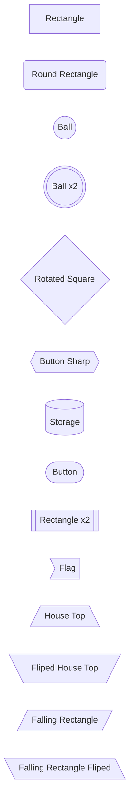

```mermaid
flowchart LR
A[Rectangle]
Ą(Round Rectangle)
B((Ball))
C(((Ball x2)))
Ć{Rotated Square}
D{{Button Sharp}}
E[(Storage)]
Ę([Button])
F[[Rectangle x2]]
G>Flag]
H[/House Top\]
I[\Fliped House Top/]
J[/Falling Rectangle/]
K[\Falling Rectangle Fliped\]
```
