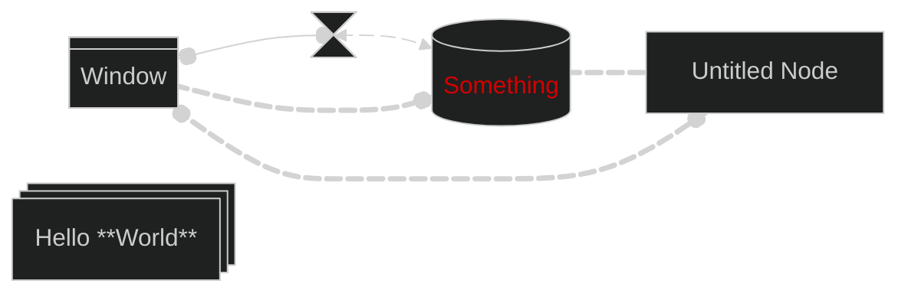

```mermaid
---
config:
  layout: fixed
  theme: dark
---
flowchart LR
    n1["Window"] o--o n2["Time"]
    n2 L_n2_n3_0@<--> n3["Something"]
    n3 L_n3_n4_0@=== n4["Untitled Node"]
    n4 L_n4_n1_0@o==o n1
    n1 L_n1_n3_0@==o n3
    n5["Hello **World**"]

    n1@{ shape: div-proc}
    n2@{ shape: collate}
    n3@{ shape: db}
    n5@{ shape: procs}
    style n3 color:#D50000

    L_n2_n3_0@{ animation: fast } 
    L_n3_n4_0@{ animation: slow } 
    L_n4_n1_0@{ animation: fast } 
    L_n1_n3_0@{ animation: slow }
```
